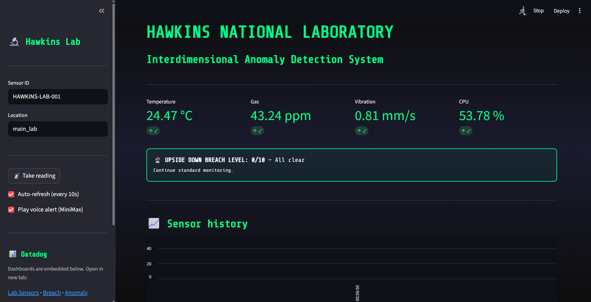
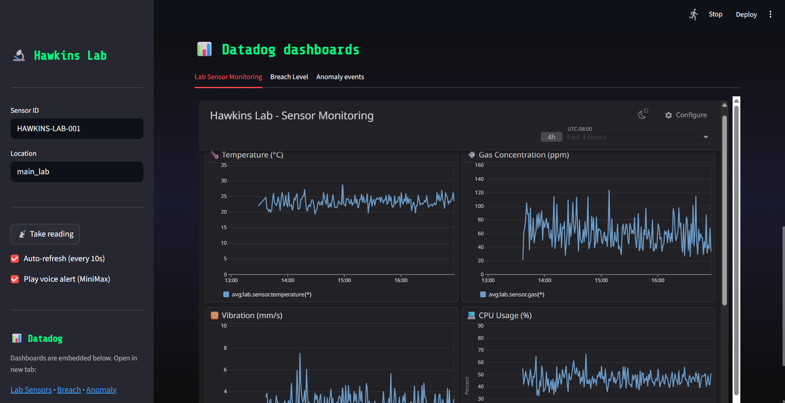

# Hawkins Lab: Interdimensional Anomaly Detection

A **Stranger Things–themed** AI system that monitors simulated lab sensors for unusual activity. It uses **AWS Bedrock** for real-time themed explanations of anomalies, **Datadog** for metrics and embedded dashboards, and **MiniMax** for voice alerts. The system detects multi-sensor anomalies, scores “Upside Down breach” severity (1–10), and includes an optional **Streamlit** dashboard with embedded Datadog views.

---

## What This Does

- **Simulates lab sensors** (temperature, gas, vibration, CPU) with configurable anomaly probability.
- **Detects anomalies** via threshold and z-score methods.
- **Computes breach level** (0–10) from how many sensors trigger; multi-sensor = higher “Upside Down” severity.
- **AWS Bedrock**: Generates Stranger Things–style explanations for each anomaly (or fallback messages if Bedrock is off).
- **Datadog**: Sends sensor metrics, anomaly events, and breach level; Streamlit embeds Lab Sensors, Breach Level, and Anomaly Events dashboards (embed URLs; allowlist referrer in Datadog).
- **MiniMax**: Optional TTS voice alerts on anomaly — speaks only “Alert! Alert! Alert!” or “Warning! Warning! Warning!” (autoplay in Streamlit; system player in CLI).
- **Streamlit**: Themed dashboard to take readings, view history, AI explanations, embedded Datadog dashboards, and optional voice alert; auto-refresh every 10 seconds.

---

## Screenshots

| Streamlit dashboard | Datadog monitoring |
|---------------------|--------------------|
|  |  |

*Left: Hawkins Lab Streamlit UI — sensor readings, breach level, AI analysis, and voice alert. Right: Datadog dashboards (Lab Sensor Monitoring, Breach Level, Anomaly Events) showing live metrics.*

---

## Project Structure

```
├── main.py                    # CLI pipeline (sensors → detect → breach → Bedrock → Datadog)
├── streamlit_app.py            # Themed Streamlit dashboard (embeds Datadog, 10s refresh, voice)
├── sensor_simulator.py        # Lab sensor data simulation
├── anomaly_detector.py        # Threshold + z-score anomaly detection
├── breach_correlator.py       # Upside Down breach level (0–10)
├── aws_bedrock_integration.py # Stranger Things AI explanations (Bedrock)
├── datadog_metrics.py         # Datadog metrics, events, dashboard creation
├── minimax_voice.py           # MiniMax TTS: "Alert! Alert! Alert!" / "Warning! Warning! Warning!"
├── requirements.txt
├── .env.example               # Template for secrets (copy to .env)
└── README.md
```

---

## Prerequisites

- **Python 3.10+**
- **AWS account** with Bedrock access and Claude model enabled.
- **Datadog account** and API + Application keys (see Configuration below).
- **MiniMax** (optional): API key and Group ID for voice alerts (TTS).

---

## Installation

```bash
# Clone and enter project
cd "AWS x Datadog Hackathon"

# Virtual environment
python -m venv venv
.\venv\Scripts\activate          # Windows
# source venv/bin/activate       # macOS/Linux

# Dependencies
pip install -r requirements.txt

# Config (copy .env.example to .env and add your AWS and Datadog keys)
copy .env.example .env           # Windows
# cp .env.example .env            # macOS/Linux
# Edit .env with AWS and Datadog keys
```

---

## Running the Application

### 1. CLI (full pipeline)

Runs the simulator on a timer, detects anomalies, computes breach level, sends to Datadog, and requests Bedrock explanations when anomalies occur:

```bash
python main.py
```

Press **Ctrl+C** to stop.

### 2. Streamlit dashboard

Themed UI: take readings, breach level, sensor history charts, AI explanations, and **embedded Datadog dashboards** (Lab Sensors, Breach Level, Anomaly Events). Optional **voice alert** (MiniMax) plays automatically on anomaly (“Alert! Alert! Alert!” or “Warning! Warning! Warning!”).

```bash
streamlit run streamlit_app.py
```

Use **Take reading** in the sidebar. Enable **Auto-refresh (every 10s)** for updates every 10 seconds. In Datadog, use **Share → Embed** for each dashboard and allowlist your Streamlit origin (e.g. `http://localhost:8501`) so the iframes load.

### 3. Test individual modules

```bash
python sensor_simulator.py    # Sensor data only
python anomaly_detector.py    # Anomaly detection demo
python datadog_metrics.py    # Datadog client demo
python aws_bedrock_integration.py   # Bedrock/fallback explanation demo
```

---

## Configuration (.env)

| Variable | Description | Default |
|----------|-------------|---------|
| `AWS_ACCESS_KEY_ID` | AWS access key | — |
| `AWS_SECRET_ACCESS_KEY` | AWS secret key | — |
| `AWS_REGION` | AWS region for Bedrock | `us-east-1` |
| `BEDROCK_MODEL_ID` | Bedrock model | `anthropic.claude-opus-4-6-v1` (Claude Opus 4.6) |
| `DD_API_KEY` | Datadog API key | — |
| `DD_APP_KEY` | Datadog Application key | — |
| `DD_SITE` | Datadog site | `datadoghq.com` |
| `DD_EMBED_LAB_SENSORS` | (Optional) Datadog embed URL for Lab Sensors | built-in embed URL |
| `DD_EMBED_BREACH_LEVEL` | (Optional) Datadog embed URL for Breach Level | built-in embed URL |
| `DD_EMBED_ANOMALY_EVENTS` | (Optional) Datadog embed URL for Anomaly Events | built-in embed URL |
| `MINIMAX_API_KEY` | (Optional) MiniMax API key for TTS | — |
| `MINIMAX_GROUP_ID` | (Optional) MiniMax group ID for TTS | — |
| `ENABLE_VOICE_ALERT` | Enable MiniMax voice alert on anomaly | `true` |
| `VOICE_ALERT_PREFIX` | TTS phrase: `Alert! Alert! Alert!` or `Warning! Warning! Warning!` | `Alert! Alert! Alert!` |
| `SENSOR_ID` | Sensor station ID | `HAWKINS-LAB-001` |
| `LOCATION` | Location tag | `main_lab` |
| `POLLING_INTERVAL` | Seconds between readings (CLI) | `5.0` |
| `ENABLE_BEDROCK` | Use AWS Bedrock for AI | `true` |
| `ENABLE_DATADOG` | Send metrics/events to Datadog | `true` |

---

## Setup

1. **AWS**: Use an account with Bedrock access; enable Claude in `us-east-1`; create IAM access keys and add to `.env`.
2. **Datadog**: Create an account, copy API key and create an Application key in Organization Settings, add to `.env`. For Streamlit embeds, use Share → Embed on each dashboard and allowlist `http://localhost:8501` (or your app URL).
3. **MiniMax** (optional): Add `MINIMAX_API_KEY` and `MINIMAX_GROUP_ID` to `.env` for voice alerts. Set `VOICE_ALERT_PREFIX=Warning! Warning! Warning!` for the alternate phrase.
4. **.env**: Copy `.env.example` to `.env`, fill in your keys, and do not commit `.env`.

---

## Datadog Metrics & Dashboard

- **Metrics**: `lab.sensor.temperature`, `lab.sensor.gas`, `lab.sensor.vibration`, `lab.sensor.cpu_usage`, `lab.anomaly.detected`, `lab.breach.level`.
- **Events**: Anomaly alerts with title like “Upside Down breach detected! Level X/10”.
- **Dashboard**: Use `DatadogMetricsClient().create_sensor_dashboard()` once (or create widgets in the UI for the metrics above).
- **Streamlit embeds**: The app embeds three dashboards (Lab Sensor Monitoring, Breach Level, Anomaly Events) via `p.datadoghq.com/sb/embed/...` URLs. In Datadog, use **Share → Embed** on each dashboard and add your Streamlit origin to allowed referrers (e.g. `http://localhost:8501`).

---

## Architecture

```
┌─────────────────┐     ┌──────────────────┐     ┌─────────────────────┐
│  Sensor         │────▶│  Anomaly         │────▶│  Breach Correlator  │
│  Simulator      │     │  Detector        │     │  (Level 0–10)       │
└─────────────────┘     └──────────────────┘     └──────────┬──────────┘
        │                           │                        │
        │                           │                        ▼
        │                           │              ┌─────────────────────┐
        │                           │              │  AWS Bedrock        │
        │                           │              │  (Stranger Things   │
        │                           │              │   explanations)     │
        │                           │              └──────────┬──────────┘
        │                           │                         │
        │                           │                         ▼
        │                           │              ┌─────────────────────┐
        │                           │              │  MiniMax (optional)  │
        │                           │              │  Voice: Alert! x3   │
        │                           │              └─────────────────────┘
        ▼                           ▼
┌─────────────────────────────────────────────────────────────────────────┐
│  Datadog: metrics (sensors, breach level), events, embedded dashboards   │
└─────────────────────────────────────────────────────────────────────────┘
```

---

## License

MIT License
