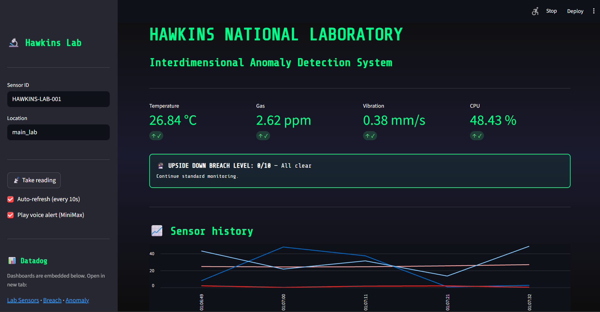
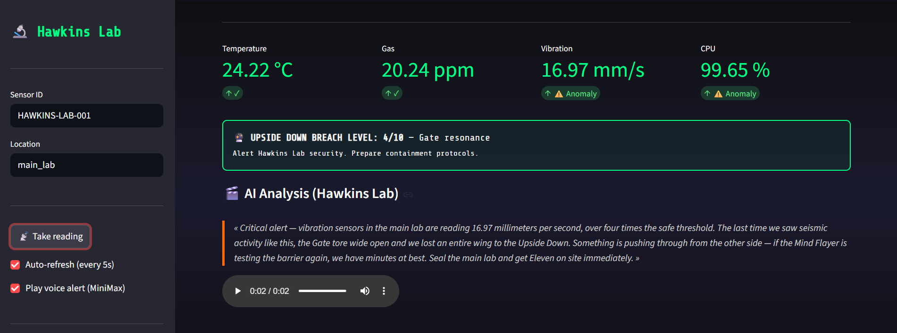

# Hawkins Lab: Interdimensional Anomaly Detection (HADS)

🏆 Built for the **AWS x Datadog Hackathon**

A **Stranger Things–themed** AI system that monitors simulated lab sensors for unusual activity. It uses **AWS Bedrock** (Claude Opus 4.6) for real-time themed explanations, **Datadog** for metrics and **embedded dashboards**, and **MiniMax** for **voice alerts** when anomalies occur. The system scores **“Upside Down breach”** severity (0–10) and includes an optional **Streamlit** dashboard with embedded Datadog views and TTS alerts.

---

## What This Does

- **Simulates lab sensors** (temperature, gas, vibration, CPU) with configurable anomaly probability.
- **Detects anomalies** via threshold and z-score methods.
- **Computes breach level** (0–10) from how many sensors trigger; multi-sensor = higher “Upside Down” severity.
- **AWS Bedrock (Claude Opus 4.6)**: Generates Stranger Things–style narrative explanations for each anomaly (model: `anthropic.claude-opus-4-6-v1`). Fallback messages are used if Bedrock is disabled or unavailable.
- **Datadog dashboards**: Sends sensor metrics, anomaly events, and breach level to Datadog. The Streamlit app **embeds three Datadog dashboards** — Lab Sensor Monitoring, Breach Level, and Anomaly Events — so you see live metrics inside the UI (embed URLs; allowlist your app’s origin in Datadog Share → Embed).
- **MiniMax voice alerts**: When an anomaly is detected, the app can play a short **text-to-speech** alert via MiniMax. The spoken phrase is **“Alert! Alert! Alert!”** or **“Warning! Warning! Warning!”** (configurable). In Streamlit the audio **autoplays**; in the CLI it opens the system default player.
- **Streamlit**: Themed UI to take readings, view breach level, AI explanations, sensor history, and embedded Datadog dashboards. Optional **Auto-refresh (every 5s)** and optional MiniMax voice alert.

---

## Screenshots

| Hawkins Lab Streamlit UI | Datadog monitoring |
|-------------------------|---------------------|
|  |  |

*Left: Hawkins Lab Streamlit UI — sensor readings, breach level, AI analysis, and voice alert. Right: Datadog dashboards showing live metrics.*

**Anomaly alert and MiniMax voice** — When an anomaly is detected, the app shows the breach level (e.g. “UPSIDE DOWN BREACH LEVEL: 4/10”), AI analysis from Bedrock, and an audio player that plays **“Alert! Alert! Alert!”** via MiniMax TTS.



---

## Project Structure

```
├── main.py                    # CLI pipeline (sensors → detect → breach → Bedrock → Datadog)
├── streamlit_app.py            # Themed Streamlit dashboard
├── sensor_simulator.py        # Lab sensor data simulation
├── anomaly_detector.py        # Threshold + z-score anomaly detection
├── breach_correlator.py       # Upside Down breach level (0–10)
├── aws_bedrock_integration.py # Stranger Things AI explanations (Bedrock)
├── datadog_metrics.py         # Datadog metrics, events, dashboard creation
├── minimax_voice.py           # MiniMax TTS voice alerts
├── requirements.txt
├── .env.example               # Template for secrets (copy to .env)
└── README.md
```

---

## Prerequisites

- **Python 3.10+**
- **AWS account** with Bedrock access and **Claude Opus 4.6** (or compatible model) enabled in your region.
- **Datadog account** and API + Application keys (see Configuration below).
- **MiniMax** (optional): API key and Group ID for voice alerts (TTS). Without these, the app runs normally; voice alert is simply skipped.

---

## Installation

```bash
# Clone and enter project
cd "AWS x Datadog Hackathon"

# Virtual environment
python -m venv venv
.\venv\Scripts\activate          # Windows
# source venv/bin/activate       # macOS/Linux

# Dependencies
pip install -r requirements.txt

# Config (copy .env.example to .env and add your AWS and Datadog keys)
copy .env.example .env           # Windows
# cp .env.example .env            # macOS/Linux
# Edit .env with AWS and Datadog keys
```

---

## Running the Application

### 1. CLI (full pipeline)

Runs the simulator on a timer, detects anomalies, computes breach level, sends to Datadog, and requests Bedrock explanations when anomalies occur:

```bash
python main.py
```

Press **Ctrl+C** to stop.

### 2. Streamlit dashboard

Themed UI: take readings, breach level, sensor history, AI explanations (Bedrock), **embedded Datadog dashboards** (Lab Sensors, Breach Level, Anomaly Events), and optional **MiniMax voice alert** (autoplay on anomaly):

```bash
streamlit run streamlit_app.py
```

Use **Take reading** in the sidebar. Enable **Auto-refresh (every 5s)** for updates every 5 seconds. For embedded dashboards to load, in Datadog use **Share → Embed** on each dashboard and add your Streamlit origin (e.g. `http://localhost:8501`) to allowed referrers.

### 3. Test individual modules

```bash
python sensor_simulator.py    # Sensor data only
python anomaly_detector.py    # Anomaly detection demo
python datadog_metrics.py    # Datadog client demo
python aws_bedrock_integration.py   # Bedrock/fallback explanation demo
```

---

## Configuration (.env)

| Variable | Description | Default |
|----------|-------------|---------|
| `AWS_ACCESS_KEY_ID` | AWS access key | — |
| `AWS_SECRET_ACCESS_KEY` | AWS secret key | — |
| `AWS_REGION` | AWS region for Bedrock | `us-east-1` |
| `BEDROCK_MODEL_ID` | Bedrock model (Claude Opus 4.6) | `anthropic.claude-opus-4-6-v1` |
| `DD_API_KEY` | Datadog API key | — |
| `DD_APP_KEY` | Datadog Application key | — |
| `DD_SITE` | Datadog site | `datadoghq.com` |
| `DD_EMBED_LAB_SENSORS` | (Optional) Datadog embed URL for Lab Sensor Monitoring | built-in |
| `DD_EMBED_BREACH_LEVEL` | (Optional) Datadog embed URL for Breach Level dashboard | built-in |
| `DD_EMBED_ANOMALY_EVENTS` | (Optional) Datadog embed URL for Anomaly Events dashboard | built-in |
| `MINIMAX_API_KEY` | (Optional) MiniMax API key for voice alerts | — |
| `MINIMAX_GROUP_ID` | (Optional) MiniMax group ID for TTS | — |
| `ENABLE_VOICE_ALERT` | Enable MiniMax voice alert on anomaly | `true` |
| `VOICE_ALERT_PREFIX` | TTS phrase: `Alert! Alert! Alert!` or `Warning! Warning! Warning!` | `Alert! Alert! Alert!` |
| `SENSOR_ID` | Sensor station ID | `HAWKINS-LAB-001` |
| `LOCATION` | Location tag | `main_lab` |
| `POLLING_INTERVAL` | Seconds between readings (CLI) | `5.0` |
| `ENABLE_BEDROCK` | Use AWS Bedrock for AI explanations | `true` |
| `ENABLE_DATADOG` | Send metrics/events to Datadog | `true` |

---

## Setup

1. **AWS Bedrock**: Use an account with Bedrock access; enable **Claude Opus 4.6** (`anthropic.claude-opus-4-6-v1`) in your region (e.g. `us-east-1`); create IAM access keys and add to `.env`.
2. **Datadog**: Create an account, copy API key and create an Application key in Organization Settings, add to `.env`. To embed dashboards in Streamlit: in Datadog open each dashboard → **Share → Embed** → copy the embed URL (optional override via `DD_EMBED_*`) and add your app origin (e.g. `http://localhost:8501`) to allowed referrers.
3. **MiniMax** (optional): Add `MINIMAX_API_KEY` and `MINIMAX_GROUP_ID` to `.env` for voice alerts. Set `VOICE_ALERT_PREFIX=Warning! Warning! Warning!` for the alternate phrase.
4. **.env**: Copy `.env.example` to `.env`, fill in your keys, and do not commit `.env`.

---

## Datadog Metrics & Dashboards

- **Metrics**: `lab.sensor.temperature`, `lab.sensor.gas`, `lab.sensor.vibration`, `lab.sensor.cpu_usage`, `lab.anomaly.detected`, `lab.breach.level`.
- **Events**: Anomaly alerts with title like “Upside Down breach detected! Level X/10”.
- **Dashboards**: The app can create a dashboard via `DatadogMetricsClient().create_sensor_dashboard()`. The **Streamlit UI embeds three Datadog dashboards** — **Lab Sensor Monitoring**, **Breach Level**, and **Anomaly Events** — so you see live metrics inside the app. Use Datadog **Share → Embed** and allowlist your Streamlit origin so the iframes load.

---

## Architecture

```
┌─────────────────┐     ┌──────────────────┐     ┌─────────────────────┐
│  Sensor         │────▶│  Anomaly         │────▶│  Breach Correlator  │
│  Simulator      │     │  Detector        │     │  (Level 0–10)       │
└─────────────────┘     └──────────────────┘     └──────────┬──────────┘
        │                           │                        │
        │                           │                        ▼
        │                           │              ┌─────────────────────┐
        │                           │              │  AWS Bedrock        │
        │                           │              │  Claude Opus 4.6     │
        │                           │              │  (Stranger Things   │
        │                           │              │   explanations)     │
        │                           │              └──────────┬──────────┘
        │                           │                         │
        │                           │                         ▼
        │                           │              ┌─────────────────────┐
        │                           │              │  MiniMax (optional) │
        │                           │              │  Voice: Alert! x3  │
        │                           │              └─────────────────────┘
        ▼                           ▼
┌─────────────────────────────────────────────────────────────────────────┐
│  Datadog: metrics, events, embedded dashboards (Lab / Breach / Anomaly) │
└─────────────────────────────────────────────────────────────────────────┘
```

---

## License

MIT License
